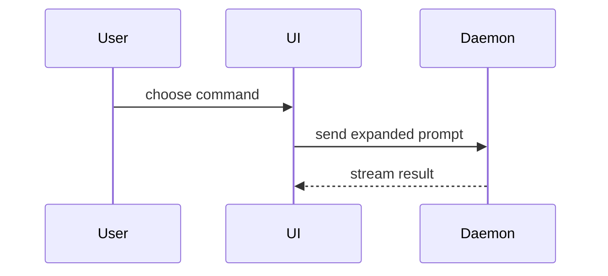

# File PR

Before filing, check whether a PR for this branch already exists.

PR title and body must be in american english. Use the domain terms from `GLOSSARY.md` when the repo has one.

Make sure the title follows the `$conventional-commits` skill. Prefer a concise, human-readable title that explains why the change matters:

BAD

> ❌ perf(server): negotiate permessage-deflate on the websocket

GOOD

> ✅ perf(server): cut websocket frame size by 70%+ with gzipping

Open the description with a simple explanation of the problem based on the user's original prompt, then briefly explain the solution. Do not lead with an implementation inventory:

BAD

> ❌ Removed implicit workspace carry-over from every "new thread" entry point (cmd+n / cmd+shift+o, sidebar v1/v2 buttons, command palette). New threads inherit only the project from context; branch, worktree, and env mode always come from the configured defaults. Delete buildContextualThreadOptions, startNewThreadInProjectFromContext, and the v1 sidebar's seed-context machinery.

GOOD

> ✅ My "new worktree" default was ignored when starting new threads on existing worktrees. Super unintuitive. Now your preferences always apply.

Use the applicable sections from this body structure in this exact order. Replace every placeholder and omit sections that have no content. If the repo has `.github/pull_request_template.md`, fill that template instead and place these sections inside it:

````markdown
## 📝 Summary

<Explain the problem, then the solution in plain language. This should be short, concise, and human-readable.>

<Visual of the change, see "Summary visual">

## ✅ Verification

- **Before:** <screenshot/output/failing test run>
  **After:** <screenshot/output/passing test run>

## 🔍 Reviews

| Review   | Found   | Fixed   |
| -------- | ------- | ------- |
| <review> | <count> | <count> |

<If any finding remains unfixed, name it and explain why.>

## 🔗 Issues

<Write "Closes #123" for every ticket the PR closes.>

## 💥 Merge danger

**Door:** <one-way or two-way>

<optional: description>

**Blast Radius:** <one-word description>

<optional: potential ramifications of merge>

## ⚠️ Needs attention

<List follow-up work, known limitations, or other issues that need the user's attention.>
````

List every review that ran, including reviews that found nothing. Never claim a check or review ran unless it did.

## Summary visual

Pick the smallest view that makes the key point clear.

- Show logic or an algorithm as pseudocode:

```text
on(save)
  if content is unchanged
    return cached result
  write new content
  return fresh result
```

- Show runtime control flow as a call tree:

```text
submitForm
  createSession
    persistPrompt
    launchAgent
  navigateToSession
```

- Show UI structure as a component tree, including state and module boundaries that matter:

```text
<SessionPage> (apps/example/src/routes/session.tsx)
  useSessionEvents()
  <SessionToolbar>
    <RunSkillButton> (packages/ui)
```

- Show file responsibility or a broad refactor as a shallow file tree:

```text
src/
├── commands/       # parses user actions
├── sessions/       # owns session state
└── transport/      # sends API requests
```

- Show component interaction, control flow, or data flow with Mermaid:



- Use `diff` when the point is what changes and the surrounding shape already exists. Match the diff shape to the topic.

For a component change:

```diff
 <SessionPage>
   useSessionEvents()
   <SessionToolbar>
+    <RunSkillButton />
   <SessionTimeline>
+    <SkillResultCard />
```

For a file-layout change:

```diff
 src/
 ├── commands/
+│   └── show-me.ts       # expands the slash command
 ├── sessions/
-└── transport.ts
+└── transport/
+    ├── client.ts
+    └── stream.ts
```

For a call-tree or call-stack change:

```diff
 submitForm
   createSession
     persistPrompt
+    expandSkillMention
     launchAgent
-  navigateToSession
+  navigateToSession
+    subscribeToEvents
```

For a state or control-flow change:

```diff
 on(save)
-  write content
+  if content is unchanged
+    return cached result
+  write new content
+  invalidate cache
```

- Show the whole block when most of it is new, when omitted context would hide ownership or order, or when the user needs a copyable target shape:

```ts
function expandSkill(command: string): string {
  const skillName = command.slice(1);
  return `use the ${skillName} skill`;
}
```

Place each visual next to the short text it supports. Keep only the calls, files, props, states, and boundaries needed to answer the user's current question or the options to resolve the current discussion point.

You may use one of these, you may use several, it is unlikely you will use all of them. Use your judgement and don't overwhelm the user.

## Verification

Concrete evidence that the change works. Show a before and after.

Screenshots are S-tier - when the environment is set up for it and the change is visual. Always inline images instead of linking to them.

Execution-based evidence is A-tier. Test results, console output. Show the exact test that now fails and passes, using pseudocode.

## Merge danger

Describe whether it's a one-way or two-way door. You can walk back through two-way doors, but not one-way doors. A PR that is cheap to roll back is lower risk. Changes that involve destructive actions or hard-to-reverse decisions are one-way doors.

The blast radius is the potential impact or scope of the changes introduced by this PR. Consider all possibilities. Examples are layout shift, breakages for consumers, mobile responsiveness, etc.

## Filing

Open a real PR, not a draft. Add the `skip-ci` and `skip-deploy` labels to the PR, if the user requests to skip ci and the labels exist.
